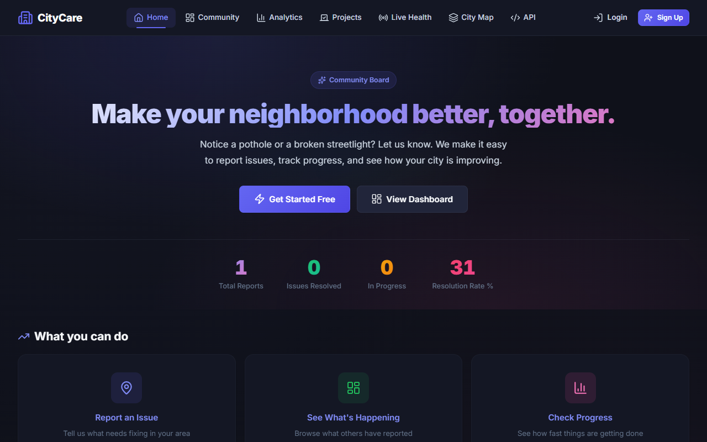
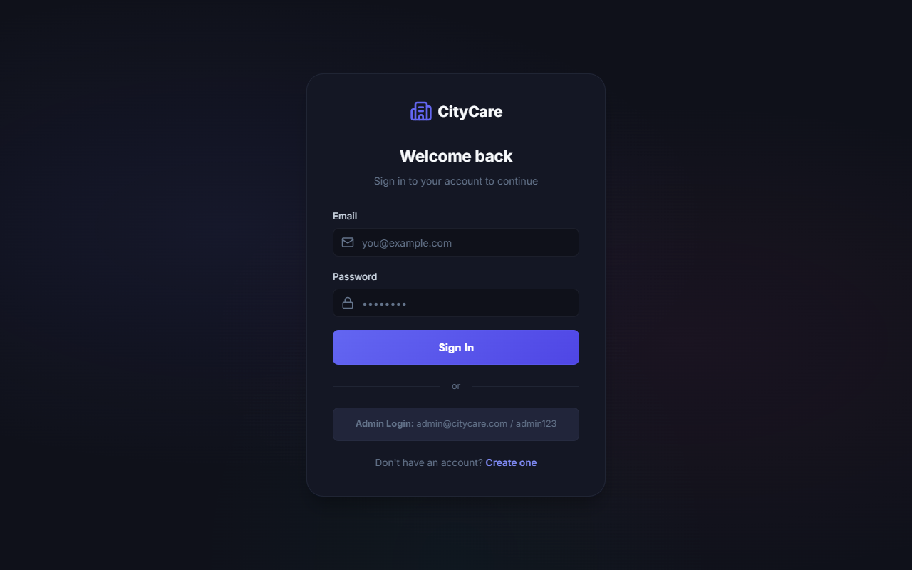
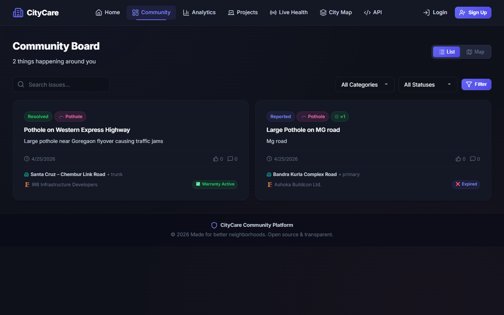
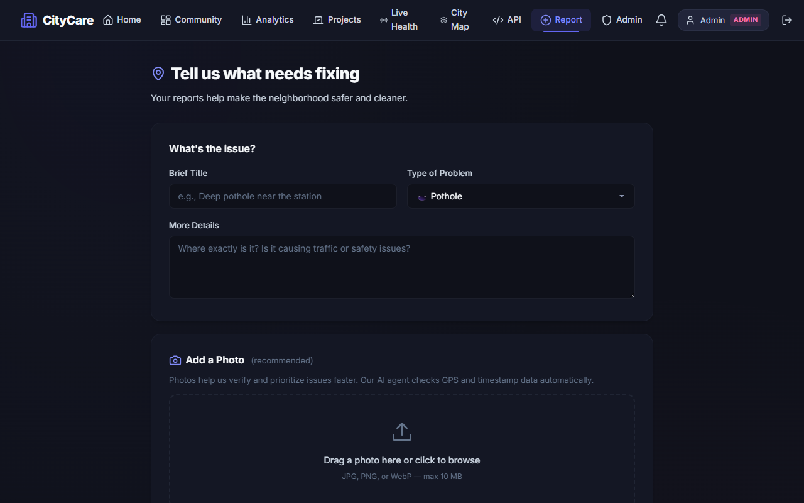
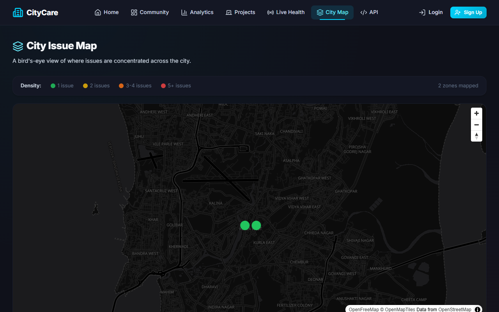
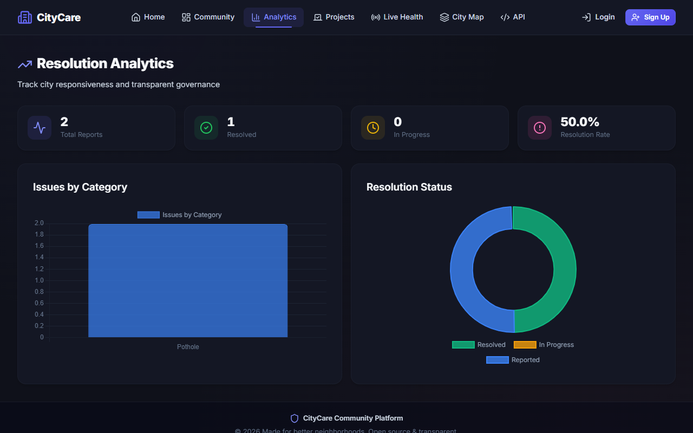
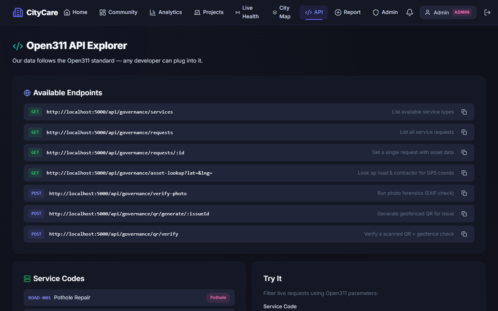
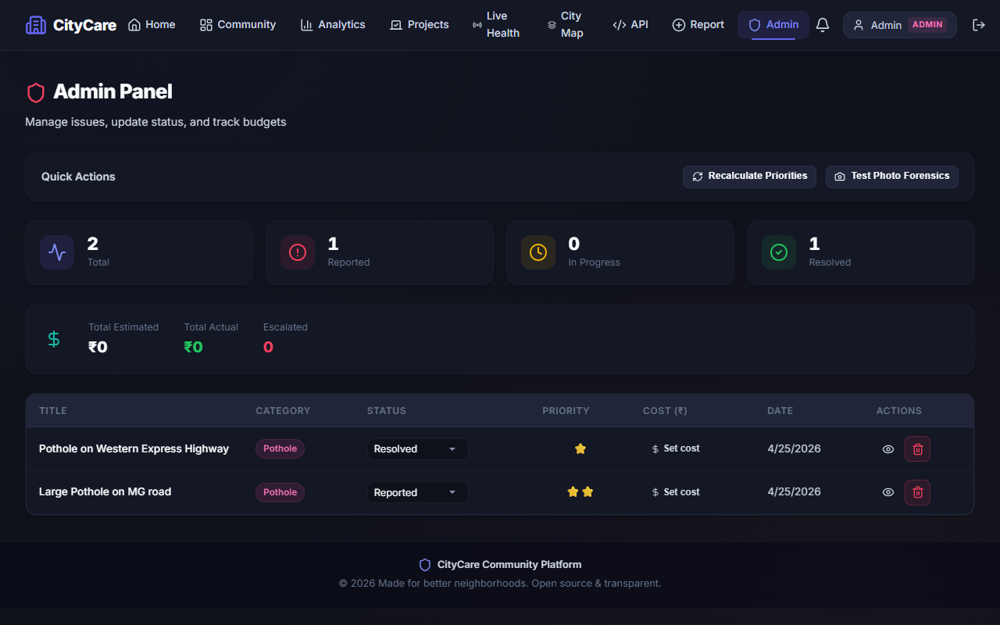
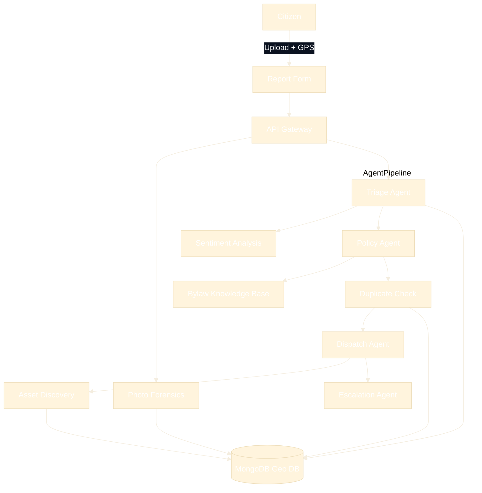

<p align="center">
  
</p>

<h1 align="center">🏙️ CityCare</h1>

<p align="center">
  <strong>A full-stack civic issue reporting platform for smarter, more transparent cities.</strong>
</p>

<p align="center">
  
  
  
  
  
  
</p>

---

## 📋 Overview

CityCare empowers citizens to **report civic issues** — potholes, broken streetlights, garbage dumping, water leaks — by pinning locations on an interactive map. City administrators can **track, manage, and resolve** reports through a dedicated admin panel, while the public can monitor progress with real-time analytics.

### ✨ Key Features

| Feature | Description |
|---------|-------------|
| 🗺️ **Vector Maps** | Interactive, high-performance vector maps using MapLibre GL JS |
| 📸 **Agentic Photo Uploads** | Drag-and-drop photos with auto AI forensics (EXIF & Hash checks) |
| 🤖 **LangGraph Agent Swarm** | 5 autonomous AI agents handling Triage, Policy checks, Dispatch, and Escalation |
| 📚 **RAG Policy Enforcement** | Auto-checks complaints against embedded city bylaws to reject invalid requests |
| 👯 **Semantic Duplicate Check** | Uses Nomic vector embeddings to auto-merge 82%+ similar reports within 500m |
| 🏢 **Digital Twin** | City heatmap visualizing issue density clusters |
| 🔌 **Open311 API** | Developer-friendly API explorer for civic interoperability |
| 📱 **Proof of Fix** | Geofenced QR Code generation for contractors to verify repairs on-site |
| 🔐 **Authentication** | JWT-based login/register with citizen & admin roles |
| 🛡️ **Admin Panel** | Manage all issues, track budgets, run forensics, recalculate priorities |
| 📊 **Analytics Dashboard** | Bar & doughnut charts for category/status breakdown |
| 👍 **Upvotes & Comments** | Citizens can upvote issues and leave comments |

---

## 🖼️ Screenshots

<details>
<summary><strong>Click to view screenshots</strong></summary>

### Homepage
> Hero section with animated stat counters, quick action cards, and recent issues feed.


### Login
> Neo-Brutalist auth card with sharp borders and admin credentials hint.


### Community Board (Dashboard)
> High-performance vector map toggle with search & category/status filters.


### Report an Issue
> Agent-driven photo upload with drag-and-drop and location pinpointing.


### Digital Twin
> City heatmap visualizing issue density clusters.


### Analytics
> Real-time charts with resolution rate tracking.


### API Explorer
> Open311 Developer API Explorer for civic interoperability.


### Admin Panel
> Full issue management table with inline status updates, photo forensics, and QR generation.


</details>

---

## 🔄 Project Flow & AI Pipelines

CityCare operates on a highly automated, agent-driven architecture designed to minimize manual administrative work.



**Key Pipeline Stages:**
1. **LangGraph State Machine**: Every report enters a deterministic workflow orchestrated by `SupervisorAgent`.
2. **Intelligent Triage & RAG**: `TriageAgent` categorizes issues, while `PolicyAgent` performs semantic searches against embedded municipal bylaws (`bylaws.txt`) to determine if the city is legally responsible.
3. **Semantic Duplicates**: Active issues are vectorized. New issues within 500m with >82% semantic similarity are automatically merged.
4. **Geospatial Discovery & Dispatch**: The GPS coordinates auto-discover the specific road asset. `DispatchAgent` assigns a verified MIS contractor ID.
5. **Verification & Resolution**: Admins generate a geofenced QR code. Contractors must physically scan this code at the exact coordinates. `visualVerify` tool compares before/after photos using Llava.

---

## 🏗️ Tech Stack

### Frontend
- **React 19** — Component-based UI with hooks
- **TypeScript** — Type-safe development
- **Vite 8** — Lightning-fast HMR and builds
- **React Router** — Client-side multi-page routing
- **MapLibre GL JS** — High-performance interactive vector maps
- **Chart.js** + **React-Chartjs-2** — Analytics visualizations
- **Lucide React** — Beautiful icon library
- **Axios** — HTTP client with JWT interceptor

### Backend
- **Node.js** + **Express** — REST API server
- **MongoDB** + **Mongoose** — Document database with geospatial indexing
- **Multer** — Multipart file upload handling
- **JWT** (jsonwebtoken) — Stateless authentication
- **bcryptjs** — Secure password hashing
- **CORS** — Cross-origin resource sharing

---

## 📁 Project Structure

```
CityCare/
├── client/                     # React Frontend
│   ├── src/
│   │   ├── components/         # Shared UI components
│   │   │   ├── Layout.tsx      # Header + Footer wrapper
│   │   │   └── ProtectedRoute.tsx
│   │   ├── context/
│   │   │   └── AuthContext.tsx  # Auth state management
│   │   ├── pages/
│   │   │   ├── HomePage.tsx    # Landing page with animated stats
│   │   │   ├── LoginPage.tsx   # Citizen & admin login
│   │   │   ├── RegisterPage.tsx
│   │   │   ├── DashboardPage.tsx  # Map/list view of all issues
│   │   │   ├── ReportPage.tsx  # Report a new issue
│   │   │   ├── AnalyticsPage.tsx  # Charts & metrics
│   │   │   ├── IssueDetailPage.tsx # Single issue + comments
│   │   │   ├── ProfilePage.tsx # User's reports
│   │   │   └── AdminPage.tsx   # Admin management panel
│   │   ├── services/
│   │   │   └── api.ts          # Axios instance + all API calls
│   │   ├── types/
│   │   │   └── index.ts        # TypeScript interfaces
│   │   ├── App.tsx             # Route definitions
│   │   ├── main.tsx            # Entry point + BrowserRouter
│   │   └── index.css           # Design system (dark theme)
│   └── index.html
│
├── server/                     # Express Backend
│   ├── config/
│   │   └── db.js               # MongoDB connection
│   ├── controllers/
│   │   ├── authController.js   # Register, login, getMe
│   │   └── issueController.js  # CRUD + stats + upvote + comment
│   ├── middleware/
│   │   ├── authMiddleware.js   # JWT protect & adminOnly guards
│   │   └── errorMiddleware.js  # Global error handler
│   ├── models/
│   │   ├── User.js             # User schema (bcrypt)
│   │   └── Issue.js            # Issue schema (GeoJSON + comments)
│   ├── routes/
│   │   ├── authRoutes.js
│   │   └── issueRoutes.js
│   ├── seed.js                 # Create default admin user
│   └── server.js               # App entry point
│
├── .gitignore
└── README.md
```

---

## 🚀 Getting Started

### 1️⃣ Prerequisites

Before you begin, ensure you have the following installed on your machine:
1. **[Node.js](https://nodejs.org/en/download/)** (v18 or higher)
2. **[MongoDB Community Server](https://www.mongodb.com/try/download/community)**
   - **CRITICAL:** You *must* install MongoDB and have it running locally in the background. The backend API will crash if it cannot connect to the database.
   - *Windows Users:* Download the `.msi` installer, run it, and ensure "Install MongoDB as a Service" is checked so it runs automatically.

### 2️⃣ Clone the Repository

Open your terminal or command prompt:
```bash
git clone https://github.com/YOUR_USERNAME/CityCare.git
cd CityCare
```

### 3️⃣ Backend Setup (Terminal 1)

In your terminal, navigate to the `server` directory and install dependencies:

```bash
cd server
npm install
```

Create a `.env` file in the `server` directory with the following content:
```env
PORT=5000
MONGO_URI=mongodb://127.0.0.1:27017/smart_city_feedback
JWT_SECRET=citycare_secret_key_2026
```

**Seed the Database (One-time setup):**
To use the admin panel, run the seed script to create the master admin account:
```bash
node seed.js
```

**Start the Backend Server:**
```bash
npm run dev
```
> You should see: `🚀 CityCare Backend running on http://localhost:5000` and `✅ MongoDB Connected`.
> *Leave this terminal window open.*

### 4️⃣ Frontend Setup (Terminal 2)

Open a **new, separate terminal window**, and navigate to the `client` directory:

```bash
cd client
npm install
npm run dev
```
> The frontend will be available at `http://localhost:5173`. Open this URL in your browser.
> *Leave this terminal window open.*

### 5️⃣ Testing the Application

Once both servers are running:
1. Go to `http://localhost:5173` in your browser.
2. **Citizen Access:** Click "Sign Up" to create a standard user account and report issues.
3. **Admin Access:** Click "Login" and use the default master credentials:
   - **Email:** `admin@citycare.com`
   - **Password:** `admin123`

---

## 🔌 API Endpoints

### Authentication
| Method | Endpoint | Description | Access |
|--------|----------|-------------|--------|
| `POST` | `/api/auth/register` | Register new citizen | Public |
| `POST` | `/api/auth/login` | Login & get JWT | Public |
| `GET` | `/api/auth/me` | Get current user | Auth |

### Issues
| Method | Endpoint | Description | Access |
|--------|----------|-------------|--------|
| `GET` | `/api/issues` | List all issues (filterable) | Public |
| `GET` | `/api/issues/stats` | Aggregated statistics | Public |
| `GET` | `/api/issues/nearby?lat=&lng=` | Geospatial search | Public |
| `GET` | `/api/issues/my` | User's own issues | Auth |
| `GET` | `/api/issues/:id` | Get single issue | Public |
| `POST` | `/api/issues` | Create new issue | Auth |
| `POST` | `/api/issues/upload-image` | Upload an image via multipart | Auth |
| `POST` | `/api/issues/:id/upvote` | Upvote an issue | Auth |
| `POST` | `/api/issues/:id/comments` | Add comment | Auth |
| `PUT` | `/api/issues/:id` | Update issue (status) | Admin |
| `DELETE` | `/api/issues/:id` | Delete issue | Admin |

### Governance (Agentic Features)
| Method | Endpoint | Description | Access |
|--------|----------|-------------|--------|
| `POST` | `/api/governance/verify-photo` | AI Forensics EXIF & Hash check | Admin |
| `POST` | `/api/governance/qr/generate/:id`| Generate Geofenced QR for repair | Admin |
| `GET` | `/api/governance/services` | Open311 standard service codes | Public |
| `GET` | `/api/governance/requests` | Open311 live request feed | Public |
| `GET` | `/api/governance/asset-lookup` | Auto-discover road/contractor by GPS| Public |
| `POST` | `/api/governance/recalculate-priorities`| Batch algorithmic priority update | Admin |

---

## 🎨 Design

The UI follows a **Neo-Brutalist dark theme** design language:

- **Colors**: Cyan, Neon Mint, and Purple pop-color accents on a high-contrast monochrome dark background
- **Typography**: Inter (Google Fonts) with tight letter-spacing
- **Effects**: Sharp 0px corners, hard shadows, high-contrast borders
- **Interactions**: Tangible, click-reactive UI components with button shadow offsets, staggered entry animations
- **Maps**: CartoDB Dark Matter tiles for cohesive dark theme

---

## 🛣️ Route Map

| Path | Page | Access |
|------|------|--------|
| `/` | Home | Public |
| `/login` | Login | Public |
| `/register` | Register | Public |
| `/dashboard` | Community Board (Map/List) | Public |
| `/sensors` | Live Health (Sensors) | Public |
| `/digital-twin` | City Map Heatmap | Public |
| `/api-explorer` | Open311 API Explorer | Public |
| `/report` | Report Issue | 🔒 Logged in |
| `/analytics` | Analytics | Public |
| `/issues/:id` | Issue Detail | Public |
| `/profile` | Profile | 🔒 Logged in |
| `/admin` | Admin Panel | 🔒 Admin only |

---

## 📄 License

This project is open source and available under the [MIT License](LICENSE).

---

<p align="center">
  Built with ❤️ for smarter cities
</p>
