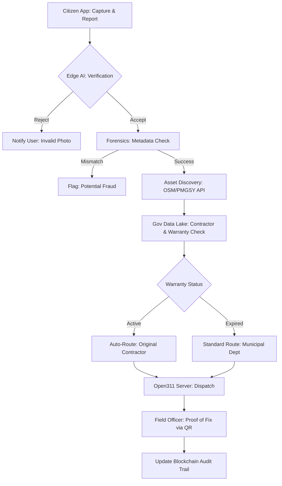

# CityCare: Smart Governance Architecture

This document outlines the high-level system design for CityCare, focusing on transparency, AI-driven trust, and interoperability with government infrastructure.

## 1. System Flow Overview



---

## 2. Component Breakdown

### A. Asset Discovery & Gov Integration
- **OSM Overpass API:** Used to reverse-geocode coordinates and fetch the `way_id` or `node_id`. 
- **PMGSY/OMMAS Integration:** If the road is rural/national, query OMMAS to get the **Asset ID**. 
- **Warranty Logic:** 
  - Query NHAI/PWD database for `construction_date` and `contractor_name`.
  - **Automated DLP Rule:** `if (currentTime - constructionDate < 3 years) -> action = "CONTRACTOR_OBLIGATION"`.

### B. The Trust Stack (Verification)
- **AI Vision:** Local **Ollama (Llava)** instance on the server. 
  - *Prompt:* "Identify if this image contains a pothole, broken light, or garbage. Respond only with the category name."
- **EXIF Forensics:** Use `exiftool` to extract `GPSLatitude`, `GPSLongitude`, and `DateTimeOriginal`. Compare with the submission metadata. 
- **Geo-fenced QR:** The QR code ID is bound to the Asset ID. The API will reject a 'Fixed' status update if the field officer's GPS is > 10m from the asset location.

### C. Backend Logic (Java/MASF Algorithm)
To handle high-volume municipal traffic, we implement a weighted priority queue using Java-based logic:

```java
public double calculatePriority(Issue issue) {
    double severityWeight = 0.5;
    double upvoteWeight = 0.3;
    double timeWeight = 0.2;
    
    long daysPending = ChronoUnit.DAYS.between(issue.getCreatedAt(), LocalDate.now());
    
    return (issue.getSeverityScore() * severityWeight) + 
           (issue.getUpvotes() * upvoteWeight) + 
           (daysPending * timeWeight);
}
```

---

## 3. Sample API Response (Open311 + Gov Data)

CityCare will output a standardized JSON format that municipalities can ingest directly.

```json
{
  "service_request_id": "CC-2026-X99",
  "service_name": "Pothole Repair",
  "status": "dispatched",
  "address": "Linking Road, Bandra West",
  "lat": 19.0596,
  "long": 72.8295,
  "ai_verified": true,
  "government_asset_meta": {
    "asset_id": "NH-48-Bandra-01",
    "road_type": "National Highway",
    "contractor": "L&T Infrastructure",
    "last_repair_date": "2024-11-12",
    "warranty_active": true,
    "repair_type": "NO_COST_DLP_CLAIM"
  },
  "priority_score": 8.4
}
```

---

## 4. Security & Identity Protocol

To ensure privacy while maintaining accountability, CityCare uses a **Zero-Local-Storage (ZLS)** auth strategy:

1. **Auth Bridge:** Use **API Setu** to trigger a DigiLocker/Aadhaar OTP flow.
2. **Stateless Identity:** Upon success, API Setu returns a temporary `OIDC ID Token` and a **Digital Signature**. 
3. **Anonymized Key:** CityCare stores a SHA-256 hash of the Aadhaar ID as a unique identifier for the reputation system, but **never stores the actual Aadhaar number or biometric data**.
4. **Auditability:** Every report is signed by this hash, ensuring that a user can be held accountable for fake reports without exposing their identity to the database admins.

## 5. Deployment Roadmap

| Phase | Task | Tech Stack | Status |
|---|---|---|---|
| **Phase 1** | OSM/Overpass API for Road ID mapping | Node.js / axios | 🔲 TODO |
| **Phase 2** | Ollama Vision validation + EXIF Forensics | Ollama / exif-reader | 🔲 TODO |
| **Phase 3** | Open311 Protocol Endpoint Development | TypeScript / Express | 🔲 TODO |
| **Phase 4** | Weighted Priority Algorithm | TypeScript (ported from Java) | 🔲 TODO |
| **Phase 5** | QR Scan & Geo-fencing for Field Officers | React / qrcode / Leaflet | 🔲 TODO |
